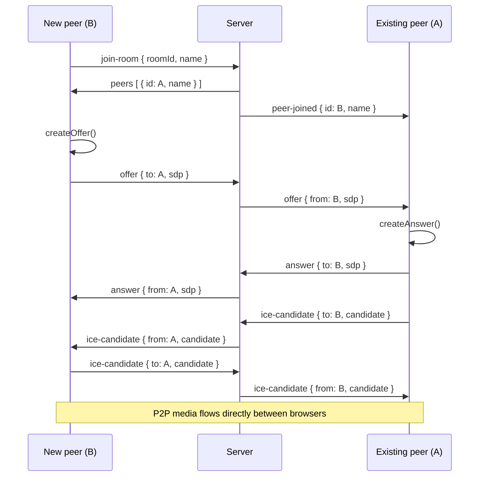

# VC Meet

A real-time video meeting app with WebRTC and Socket.io. Create or join rooms by ID, share your camera, mute/unmute, share your screen, record, and chat with other participants.

---

## Table of contents

- [Features](#features)
- [Tech stack](#tech-stack)
- [Architecture](#architecture)
- [How it works](#how-it-works)
- [Project structure](#project-structure)
- [Socket.io API](#socketio-api-server-relay)
- [Getting started](#getting-started)
- [Deployment (Vercel + Railway)](#deployment-vercel--railway) — **Step-by-step:** see [DEPLOY.md](./DEPLOY.md).

---

## Features

| Feature | Description |
|--------|-------------|
| **Multi-user video calls** | Peer-to-peer video and audio via WebRTC; mesh topology (each participant has a connection to every other). |
| **Display names** | Set your name before joining; it’s sent on join and shown on tiles and in chat. |
| **Mute / Unmute** | Toggle microphone; only affects your sent stream. |
| **Video on/off** | Turn camera off; you and others see a grey placeholder with your initial instead of a black bar. |
| **Screen sharing** | One active sharer per room; shared screen is the main large tile, cameras shown in a sidebar. |
| **Screen recording** | Local recording of the shared screen (or a new capture) and download as WebM. |
| **In-call chat** | Room-scoped text chat with name and timestamp. |
| **Room ID & invite** | Join by room ID; room is encoded in the URL (`/?room=<id>`) for easy sharing. |
| **Create / Join** | Create a random room or join an existing one; name required for both. |

---

## Tech Stack

| Layer | Technology |
|-------|------------|
| **Frontend** | Next.js 16 (App Router), React 19, TypeScript, Tailwind CSS 4 |
| **Signaling** | Socket.io (client + server) |
| **Media** | WebRTC (browser APIs), `getUserMedia`, `getDisplayMedia`, `MediaRecorder` |
| **Runtime** | Node.js, custom HTTP server that serves Next and mounts Socket.io on `/socket.io` |

---

## Architecture

### High-level

- **Next.js** serves the React app and static assets.
- A **custom Node HTTP server** (`server.js`) uses Next’s request handler and attaches a **Socket.io** server on the same origin (`path: "/socket.io"`).
- **Signaling** (join/leave, offers/answers, ICE, chat, screen-share, video-state) goes over Socket.io.
- **Media** (audio/video) flows **peer-to-peer** between browsers via WebRTC; the server never sees media.

### System diagram

```
┌─────────────────────────────────────────────────────────────────────────────┐
│                              Browser (Client A)                               │
│  ┌─────────────┐   ┌──────────────┐   ┌─────────────────────────────────┐   │
│  │   Next.js   │   │  Socket.io   │   │  WebRTC (RTCPeerConnection)      │   │
│  │   (React)   │◄──►│   Client     │   │  • Local stream (cam + mic)      │   │
│  │             │   │              │   │  • Remote streams (peers)        │   │
│  │ • TopBar    │   │ • Signaling  │   │  • Screen track (optional)       │   │
│  │ • VideoGrid   │   │ • Chat      │   └─────────────┬───────────────────┘   │
│  │ • BottomBar│   │ • Room/State │                 │ media (P2P)             │
│  │ • ChatPanel│   └──────┬───────┘                 │                         │
│  └─────────────┘         │                         │                         │
└──────────────────────────┼─────────────────────────┼─────────────────────────┘
                           │ signaling               │
                           ▼                         │
┌──────────────────────────┴─────────────────────────┴─────────────────────────┐
│                         Node.js Server (single process)                       │
│  ┌──────────────────────────────────────────────────────────────────────┐   │
│  │  HTTP Server  │  Next.js (handle)  │  Socket.io (path: /socket.io)    │   │
│  └──────────────────────────────────────────────────────────────────────┘   │
│  ┌──────────────────────────────────────────────────────────────────────┐   │
│  │  server/socket.js                                                     │   │
│  │  • Rooms (roomId → Set<socketId>)                                     │   │
│  │  • roomSharer (roomId → current sharer socketId)                      │   │
│  │  • Relays: join-room, leave-room, offer, answer, ice-candidate,       │   │
│  │    chat-message, screen-share, video-state, peer-left, etc.           │   │
│  └──────────────────────────────────────────────────────────────────────┘   │
└──────────────────────────┬───────────────────────────────────────────────────┘
                           │ signaling
                           ▼
┌─────────────────────────────────────────────────────────────────────────────┐
│                              Browser (Client B)                               │
│  ┌─────────────┐   ┌──────────────┐   ┌─────────────────────────────────┐   │
│  │   Next.js   │   │  Socket.io   │   │  WebRTC                          │   │
│  │   (React)   │◄──►│   Client     │◄──►  P2P links to A (and others)    │   │
│  └─────────────┘   └──────────────┘   └─────────────────────────────────┘   │
└─────────────────────────────────────────────────────────────────────────────┘
```

### WebRTC signaling flow (one new peer)



ASCII view:

```
  New peer (B)                Server                 Existing peer (A)
       │                         │                           │
       │  join-room { roomId, name }                         │
       │────────────────────────►│                           │
       │  peers [ { id: A, name } ]   peer-joined { id, name }│
       │◄────────────────────────│──────────────────────────►│
       │  offer → answer ↔ ice-candidates (relayed by server) │
       │◄══════════════════════════ P2P media ═══════════════►│
```

### Data flow (in-call)

```
                    ┌──────────────┐
                    │   page.tsx   │  activeRoom, displayName, isChatOpen
                    │  (router,    │  → useWebRTC(roomId, name)
                    │   state)     │  → useChat(roomId)
                    └──────┬───────┘
           ┌───────────────┼───────────────┐
           ▼               ▼               ▼
    ┌─────────────┐ ┌─────────────┐ ┌─────────────┐
    │  useWebRTC  │ │  useChat    │ │  TopBar     │
    │  • streams  │ │  • messages │ │  BottomBar  │
    │  • peers    │ │  • sendMsg  │ │  VideoGrid  │
    │  • controls │ │             │ │  ChatPanel  │
    └──────┬──────┘ └──────┬──────┘ └─────────────┘
           │               │
           └───────┬───────┘
                   ▼
            getSocket() → Socket.io
                   │
                   ▼
            server/socket.js
            (rooms, relay events)
```

---

## How It Works

### 1. Landing and joining

- On `/`, the app shows **Join a meeting**: name + room ID, and **Create new room** / **Join room**.
- **Create new room** generates a short random room ID, then navigates to `/?room=<id>` and sets that as the active room.
- **Join room** uses the typed room ID and navigates to `/?room=<id>`.
- A display name is required; it’s passed into `useWebRTC` and `useChat` as the user’s name for the session.

### 2. Entering a room (signaling)

- When `activeRoom` is set and the user has a name, `useWebRTC` runs with `roomId = activeRoom` and `name = displayName`.
- After `getUserMedia` succeeds, the client emits **join-room** `{ roomId, name }`.
- The server adds the socket to the room, stores `socket.data.roomId` and `socket.data.name`, and:
  - Sends **peers** to the joiner (other members’ ids and names).
  - Sends **peer-joined** to everyone else (new joiner’s id and name).
- The client also emits **video-state** `{ roomId, videoEnabled }` so others know whether the camera is on.

### 3. WebRTC (mesh)

- For each peer id from **peers** or **peer-joined**, the app creates or reuses an `RTCPeerConnection`.
- **Existing peers** receive **peer-joined** and create an offer, send it via **offer**; the new peer sends back **answer** and both exchange **ice-candidate** via the server.
- **New joiner** gets **peers** and creates connections; offers are created by the existing side, so the new joiner typically only answers.
- Media is sent/received on those peer connections; the server only relays signaling, not RTP/RTCP.

### 4. Screen sharing

- Only one sharer per room. The server keeps `roomSharer[roomId]` and broadcasts **screen-sharer** `{ id }` on start/stop.
- When you start sharing, the app uses `getDisplayMedia`, replaces the outbound “camera” video track with the screen track for all peer connections, and emits **screen-share** `{ roomId, isSharing: true }`.
- When someone is sharing, the UI switches to “shared content” layout: one large tile (shared screen) and a vertical strip of camera tiles. The shared stream is carried on a separate track/stream and distinguished via **screen-share** / **expectingScreenFrom** so it’s rendered in `remoteScreenStreams` and shown in the big tile.

### 5. Video off and placeholders

- Toggling video off sets `cameraTrack.enabled = false` and emits **video-state** `{ roomId, videoEnabled: false }`.
- The server broadcasts **peer-video-state** `{ peerId, videoEnabled }` to others in the room.
- Each client keeps `peerVideoEnabled[peerId]`. For the local user, the “You” tile uses `isVideoEnabled`; for remote users, the tile uses `peerVideoEnabled[peerId] === false` to show a grey block and the first letter of their name instead of the video.

### 6. Chat

- Messages are sent with **chat-message** `{ roomId, message, name }`. The server broadcasts to the room with `id`, `name`, `message`, `timestamp`.
- `useChat` subscribes to **chat-message** and appends to `messages`; `ChatPanel` renders them and calls `sendMessage(message, displayName)` on send.

### 7. Recording

- Recording is local only. It uses `MediaRecorder` on the current screen-share stream (or a new `getDisplayMedia` capture if you’re not sharing). The result is downloaded as a WebM file; the server is not involved.

---

## Project Structure

```
video-chat-app/
├── app/
│   ├── components/       # UI components
│   │   ├── BottomBar.tsx # Room ID, mute, video, screen share, record, end call, chat toggle
│   │   ├── ChatPanel.tsx # Message list + input
│   │   ├── TopBar.tsx    # Logo + user initial
│   │   ├── VideoGrid.tsx   # Layout: shared vs cameras, “You” vs remotes
│   │   └── VideoTile.tsx # One <video> + label + optional video-off placeholder
│   ├── hooks/
│   │   ├── useChat.ts    # messages, sendMessage; listens to chat-message
│   │   └── useWebRTC.ts  # streams, peers, controls, signaling, WebRTC
│   ├── icons/            # SVG icon components (mic, video, screen-share, etc.)
│   ├── lib/
│   │   └── socket.ts     # getSocket() singleton for Socket.io client
│   ├── layout.tsx
│   ├── page.tsx          # Landing vs in-call view; wires room state, WebRTC, chat
│   └── globals.css
├── server/
│   └── socket.js         # Socket.io handlers: rooms, signaling, chat, screen-share, video-state
├── server.js             # HTTP server + Next + Socket.io
├── package.json
├── next.config.ts
└── tsconfig.json
```

---

## Socket.io API (server relay)

All events are relayed or processed by `server/socket.js`. The server does not interpret SDP or ICE; it only forwards by socket id or room.

| Client → Server | Payload | Server → Others |
|-----------------|--------|------------------|
| **join-room** | `{ roomId, name }` | Stores room/name; sends **peers** to sender; **peer-joined** `{ id, name }` to room |
| **leave-room** | `{ roomId }` | **peer-left** `socket.id` to room; cleanup room/sharer |
| **offer** | `{ to, sdp }` | **offer** `{ from, sdp }` to `to` |
| **answer** | `{ to, sdp }` | **answer** `{ from, sdp }` to `to` |
| **ice-candidate** | `{ to, candidate }` | **ice-candidate** `{ from, candidate }` to `to` |
| **chat-message** | `{ roomId, message, name }` | **chat-message** `{ id, name, message, timestamp }` to room |
| **screen-share** | `{ roomId, isSharing }` | **screen-sharer** `{ id }` and **screen-share** `{ id, isSharing }` as needed |
| **video-state** | `{ roomId, videoEnabled }` | **peer-video-state** `{ peerId, videoEnabled }` to room |

On **disconnect**, the server treats the socket as having left its room and emits **peer-left** and clears sharer if applicable.

---

## Getting Started

### Prerequisites

- Node.js (v18+ recommended)
- npm (or yarn/pnpm)

### Install and run

```bash
# Install dependencies
npm install

# Development (Next.js + Socket.io on one server)
npm run dev
```

Then open [http://localhost:3000](http://localhost:3000).

- **Create a room:** Enter your name → “Create new room”. You’re taken to `/?room=<id>`.
- **Invite others:** Share the current URL (e.g. `http://localhost:3000?room=abc123`). They enter the same URL or paste the room ID and click “Join room”.
- **Join existing:** Enter your name and the room ID → “Join room”.

### Other scripts

```bash
npm run build   # Next.js production build
npm run start   # Run production server (NODE_ENV=production node server.js)
npm run lint    # eslint
```

### Port

Default port is 3000. Set `PORT` to override:

```bash
PORT=4000 npm run dev
```

---

## Deployment (Vercel + Railway)

You can run the **frontend on Vercel** and the **Socket.io server on Railway**. No database is required: rooms, peers, and chat are in-memory and ephemeral.

### 1. Socket server on Railway

- Create a new **Web Service** in Railway from this repo.
- **Root directory:** project root (default).
- **Build:** `npm install` (or leave default).
- **Start command:** `npm run start:socket` (runs `node socket-server.js`).
- **Env:**
  - `PORT` — set by Railway automatically.
  - `CORS_ORIGIN` — your Vercel app URL, e.g. `https://your-app.vercel.app`. Use a comma-separated list for multiple origins. Omit or set to `*` only for quick local testing.

After deploy, copy the public URL of the service (e.g. `https://your-app.up.railway.app`).

### 2. Frontend on Vercel

- Deploy the Next.js app to Vercel (Import Git repo → same repo; Vercel will use `next build` by default — do **not** use a custom server).
- **Env:**
  - `NEXT_PUBLIC_SOCKET_URL` — the Railway socket server URL (e.g. `https://your-app.up.railway.app`). No trailing slash.

Redeploy the frontend after changing `NEXT_PUBLIC_SOCKET_URL`. Locally, leave it unset so the client connects to the same origin when you run `npm run dev` with the full stack.

### Summary

| Part   | Host     | Command / build           | Env |
|--------|----------|---------------------------|-----|
| Next.js | Vercel   | `next build` (default)    | `NEXT_PUBLIC_SOCKET_URL` = Railway URL |
| Socket.io | Railway | `npm run start:socket`    | `CORS_ORIGIN` = Vercel URL(s) |

---

## Behaviour summary

- **Rooms** are identified by `roomId`; membership is in-memory on the server. No persistence.
- **One screen sharer per room**; starting share as a second sharer is gated by the server/sharer logic (e.g. current sharer is cleared or new share is ignored depending on product rules; here the UI reflects a single sharer).
- **Video off** is signaled so both you and others see the grey + initial placeholder.
- **Recording** is client-side only and does not use the server.

---

## License

Private / unlicensed unless otherwise specified.
